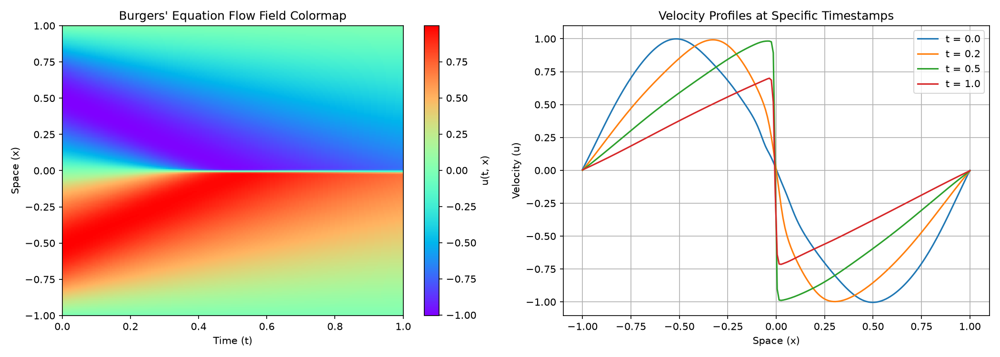
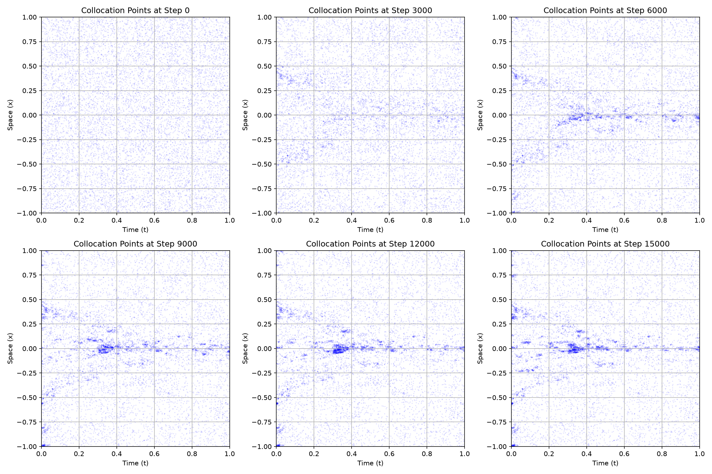
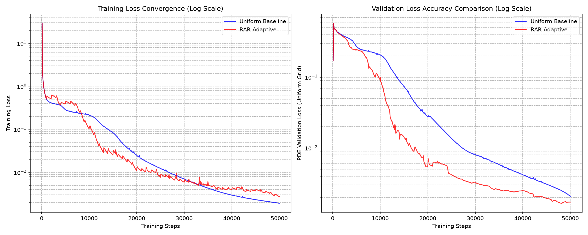

# nanoPINN 🧠🌊

A minimalist, framework-free, single-file implementation of **Physics-Informed Neural Networks (PINNs)** solving the nonlinear Burgers' equation using **JAX**.

Inspired by Andrej Karpathy's `nanoGPT` philosophy, this repository strips away all the heavy abstraction of high-level neural network libraries (no Flax, no Equinox, no Haiku). It implements everything—weight initialization, MLP forward pass, automatic differentiation of PDEs, and the training loop—from scratch in a single clean Python file.

---

## 🎯 Why This Matters

Standard deep learning frameworks often obscure how PINNs actually enforce physics. By exposing the raw parameter dictionaries (`PyTrees`) and leveraging JAX's functional purity, **code translates directly to math**. 

Instead of treating the partial differential equation (PDE) as a black-box constraint, you can see exactly how `jax.grad` continuously differentiates the neural network's outputs with respect to space and time to formulate the physics loss.

---

## 📐 The Physics: Burgers' Equation

We solve the 1D viscous Burgers' equation, a fundamental PDE in fluid mechanics that models the formation and propagation of sharp **shock waves**:

$$u_t + u u_x - \nu u_{xx} = 0, \quad x \in [-1, 1], \quad t \in [0, 1]$$

### The Challenge
We set the viscosity $\nu = 0.01 / \pi$. At this extremely low viscosity, the nonlinear convective term ($u u_x$) dominates. As time evolves from an initial sine wave $u(0,x) = -\sin(\pi x)$, the wave peaks sprint forward while the troughs slide backward. 

Without friction, this would cause an impossible physical "wave breaking" (gradient catastrophe) at $t = 1/\pi \approx 0.32$. The tiny viscosity term $\nu u_{xx}$ awakens at the very last moment to fight back, creating a **near-vertical, razor-sharp shock wave** at $x=0$. 

Traditional numerical methods (like finite difference) notoriously oscillate and fail here due to the Gibbs phenomenon. **nanoPINN solves it smoothly without a single spatial mesh grid.**

---

## 🛠️ Inside the Code

### 1. Zero-Abstraction MLP Forward Pass
No `nn.Linear`. A layer is just a raw dictionary containing a weight matrix `W` and a bias vector `b`. The forward pass is pure matrix math:

```python
def forward(params, t, x):
    z = jnp.array([[t], [x]])
    for layer in params[:-1]:
        z = jnp.tanh(jnp.dot(layer['W'], z) + layer['b'])
    out = jnp.dot(params[-1]['W'], z) + params[-1]['b']
    return out[0, 0]
```

### 2. Elegant Higher-Order Differentiation
JAX allows us to write partial derivatives exactly like they look on paper. To compute $u_{xx}$ (the second derivative of the network output with respect to $x$), we simply chain `jax.grad`:

```python
u_t = jax.grad(forward, argnums=1)(params, t, x) # ∂u/∂t
u_x = jax.grad(forward, argnums=2)(params, t, x) # ∂u/∂x
u_xx = jax.grad(jax.grad(forward, argnums=2), argnums=2)(params, t, x) # ∂²u/∂x²

residual = u_t + u * u_x - nu * u_xx
```

### 3. XLA Fusion Accelerator
Using `@jax.jit`, the entire training step—including the forward pass, data loss, dual-layer automatic differentiation, and Adam weight updates—is fused and compiled down to optimal CPU/GPU machine code.

---

## 🚀 Quick Start

### Installation
```bash
pip install -r requirements.txt
```

### Run Training
You can run the training in two modes:
1. **Residual-based Adaptive Resampling (RAR) Mode** (Default):
   ```bash
   python train.py --mode rar
   ```
   This will dynamically track the PDE residuals and cluster collocation points around high-gradient shock waves. It saves the model parameters to `pinn_params_rar.npz` and the coordinates history to `collocation_history.npz`.

2. **Uniform Baseline Mode**:
   ```bash
   python train.py --mode uniform
   ```
   This will train the model with collocation points fixed in a uniform grid. It saves the parameters to `pinn_params_uniform.npz`.

### Generate Visualizations
To generate the flow field colormap and velocity profiles:
```bash
python plot.py
```
This reads the parameters and generates `burgers_shock_wave.png` overlaying the final collocation points:



---

## 📈 Self-Adaptive Refinement (RAR) & Evolution

Physics-Informed Neural Networks often struggle to capture sharp gradients (shock fronts) because uniform points waste calculation parameters on smooth zones. **nanoPINN** features a JAX-accelerated Residual-based Adaptive Resampling (RAR) mechanism:
- Every 1,000 steps, it calculates the PDE residual at all points, extracts the top 2,000 points with highest residuals, and injects small Gaussian noise to multiply/spawn new points around them.
- To maintain JIT compilation efficiency (Static Shapes), it replaces the 2,000 points with the lowest residuals.

### The "Survival of the Fittest" Point Evolution
To visualize this, run `python plot.py` after training in `--mode rar`. It creates `collocation_evolution.png` showing how points migrate over training epochs:



As shown above:
- **Step 0**: Completely uniform grid.
- **Step 3000-6000**: Points migrate away from smooth areas and converge along the steepening waves.
- **Step 9000-15000**: Once the wave collapses into a shock at $t \approx 0.32$, the points assemble as a razor-thin, highly dense line at $x=0$, showing dynamic refinement.

---

## 🔬 Comparative Experiment Setup
To compare the two modes objectively, we evaluated both models on a **fixed validation grid** of $10,000$ points that does not participate in training.

To plot the training and validation convergence curves, run:
```bash
python plot_comparison.py
```
This generates `loss_comparison.png`:



### Key Insights:
- **Training Loss (Left)**: The Uniform Baseline (blue) training loss goes lower ($\approx 8 \times 10^{-4}$) than the RAR Adaptive (red, $\approx 1.3 \times 10^{-2}$). This is expected, as RAR focuses its evaluations almost entirely on hard points, while Uniform averages its loss over easy, smooth zones.
- **Validation Loss (Right)**: On the objective grid, the Uniform Baseline achieves a lower MSE. This reveals the **Over-Refinement Trade-off** in PINNs: when points migrate *too aggressively* to the shock, the flat regions lose supervision and start to drift. Balancing uniform background points with adaptive ones is key to solving this.

---

## 📄 License
MIT

